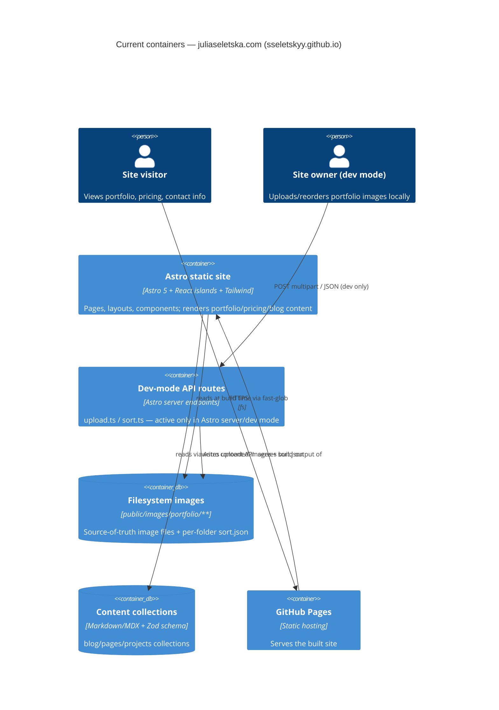

# Architecture map — juliaseletska.com (sseletskyy.github.io)

> The **current** architecture (what exists today), produced by `survey` and read by
> specify / design / data-model / implement. Refresh with `survey` when the repo drifts past
> `reflects_commit`. This is generated; a hand-maintained `docs/architecture.md`, if present, is
> authoritative and reconciled below — not replaced.

## Stack

- Language / runtime: TypeScript (strict mode, `tsconfig.json:2`) on Astro 5.1.9 (`package.json:19` deps block; output: static in prod, server in dev, `astro.config.mjs`)
- Frameworks: React 19 (islands, jsx: react-jsx), Tailwind CSS 3.4.17 (`@astrojs/tailwind`, `applyBaseStyles: false`), @astrojs/mdx, @astrojs/node, @astrojs/sitemap
- Notable deps: `react-responsive-carousel` (image carousel), `marked` (markdown → HTML for Hero text), `@dnd-kit` (drag-drop sort UI), `@astro-utils/formidable` (multipart upload parsing)
- Build / test / lint: `npm run build` (`astro build`, `package.json:12`) · no test command exists (no test framework configured anywhere in the repo) · no lint-check script exists — only `npm run format` (`prettier --write ./src`, `package.json:15`), which rewrites rather than checks

## C4 — system as it is

## Module inventory

| Module | Path | Layers | Wired at | Responsibility |
|---|---|---|---|---|
| Pages (routing) | `src/pages/` | file-based routes, `getStaticPaths` | `src/pages/portfolio/[slug].astro:13-21` | Route entry points; compose layouts + components, do build-time data prep |
| Layouts | `src/layouts/` | Base / Home variants | `src/layouts/BaseLayout.astro`, `HomeLayout.astro:29` | Page chrome: Nav/Header/Footer, ViewTransitions, hero carousel overlay |
| Components (static) | `src/components/*.astro` | presentational | `src/components/Button.astro`, `ImageGrid.astro` | Server-rendered, no client JS |
| Components (islands) | `src/components/*.tsx` | React, `client:load` | `src/components/ImageCarousel.tsx:29`, `ImageGridWithSorting.tsx:154-248` | Client-interactive: carousel, drag-sort admin grid, social icons |
| Content collections | `src/content/` | Zod-schema Markdown/MDX | `src/content/config.ts:1-44` | blog / pages / projects collections with shared SEO schema |
| Site data | `src/data/` | config objects + types | `src/data/site-config.ts:1-275`, `types.ts` | Dictionaries, portfolio/prices lists, hero/social/testimonial data, `devMode` flag |
| Utilities | `src/utils/` | pure functions | `src/utils/common-utils.ts:28-31` | slugify, className merge (`cx`), `extractFileName` |
| Styles | `src/styles/` | global CSS | `src/styles/global.css:5-17` | Tailwind directives, light/dark CSS variables, custom utility classes |
| Dev scripts | `src/scripts/` | vanilla JS | `src/scripts/portfolio-folder-sidebar.js` | Dev-mode folder sidebar behavior on portfolio pages |
| API routes (dev-mode) | `src/pages/api/` | Astro server endpoints | `src/pages/api/upload.ts`, `src/pages/api/sort.ts` | Accept image uploads / persist `sort.json` — active only when Astro runs in server mode |

## Conventions (cited — the rules a new feature must match)

- **Module wiring / registration:** file-based routing + `getStaticPaths()` declares all valid dynamic params — `src/pages/portfolio/[slug].astro:13-21`, `src/pages/prices/[slug].astro:10-17`
- **Error handling:** API routes validate input and return 400 JSON on bad requests; client-side try/catch with user-facing alert on fetch failure — `src/pages/api/upload.ts:18-24`, `src/components/ImageGridWithSorting.tsx:92-95`. No custom 404 page; relies on Astro's default.
- **IDs:** portfolio category slugs fixed by `PhotosessionType` enum — `src/data/types.ts:27-32`; image path convention `/images/portfolio/{category}/{folder}/{file}.jpg`
- **Persistence / DB access:** none — no database. Build-time filesystem discovery via `fast-glob` over `public/images/portfolio/{slug}/**/*.jpg` — `src/pages/portfolio/[slug].astro:66,69`
- **Migrations:** N/A (no datastore)
- **Tests:** none — no test framework configured anywhere in the repo (confirmed absence, not omission)
- **Inter-module communication:** direct imports + props composition (pages → layouts → components); no event bus or shared store. Client islands POST to `/api/upload` and `/api/sort` — `src/components/ImageGridWithSorting.tsx:82-96,138-152`
- **UI / styling:** Tailwind utility classes only, no CSS modules / styled-components / BEM — theme extend in `tailwind.config.cjs:16-25`, CSS custom properties for light/dark in `src/styles/global.css:5-17` (detail in §Frontend / UI foundation below)

## Datastores

| Store | Engine | Accessed via | Notes |
|---|---|---|---|
| Portfolio images | Filesystem (`public/images/portfolio/**`) | `fast-glob` scan at build time + `fs.readFileSync` for `sort.json` | No DB; folders starting with `_` are excluded (`src/pages/portfolio/[slug].astro:67`) |
| Content collections | Filesystem (Markdown/MDX under `src/content/`) | Astro content collections API, Zod-validated | `src/content/config.ts:1-44` |

## Frontend / UI foundation

- **Component library / design system:** none 3rd-party — bespoke `.astro` (static) + `.tsx` (React island) components in `src/components/`
- **Design tokens:** Tailwind theme extend (`fontFamily.sans: Inter`, `fontFamily.serif: Newsreader`, custom `text-main`/`bg-main`/`bg-muted`/`border-main` colors backed by CSS variables) — `tailwind.config.cjs:16-25`; light/dark palettes in `src/styles/global.css:5-17`
- **Styling approach:** Tailwind utility classes exclusively; `darkMode: 'class'` toggle; `@tailwindcss/typography` plugin with a custom "dante" prose preset (`tailwind.config.cjs:29-88`)
- **Shared primitives:** `Button.astro` (polymorphic link/button, `:1-24`), `ImageLinkList.astro` (responsive image+link grid, `:1-27`), `PageHeader.astro`, `Hero.astro` (markdown-rendered hero text via `marked`, `:1-29`), `SocialIcon.tsx` (icon-by-name mapping, `:1-26`)
- **State / data-fetching:** none — no store library; React islands use local `useState`; client fetch is plain `fetch()` to the two dev-mode API routes
- **Closest UI precedent:** a new portfolio-style gallery screen looks like `src/pages/portfolio/[slug].astro` — `BaseLayout` + `PageHeader` + `GoBack` + `ImageGrid`/`ImageGridWithSorting`, responsive `grid-cols-1 md:grid-cols-3`

## Where things live / closest precedents

- A new static content page (about, FAQ, etc.) → `src/content/pages/` + a route in `src/pages/`, modelled on the `blog`/`projects` collections (`src/content/config.ts:1-44`).
- A new portfolio-style gallery/category feature → `src/pages/portfolio/[slug].astro` pattern: `getStaticPaths` + build-time `fast-glob` + `sort.json` merge (`src/pages/portfolio/[slug].astro:13-21,28-64`).
- A new screen / UI component → composed from the existing design system (§Frontend), modelled on the portfolio category page (`src/pages/portfolio/[slug].astro`).

## Constraints & known tech-debt

- Dev-mode admin UI (`ImageGridWithSorting`, `/api/upload`, `/api/sort`) is gated by a `devMode` flag in `src/data/site-config.ts` and ships inside the same build rather than as a separate admin app — any change to upload/sort behavior touches production-adjacent code paths.
- No automated tests exist anywhere in the repo — new features have no regression harness to extend; manual verification is the only safety net.
- The API routes require Astro's `server`/`node` output mode to function; the production deploy is static (GitHub Pages), so upload/sort are effectively dev-only today — a feature that needs them in production would need an output-mode or hosting change.
- Dictionary-based i18n scaffolding exists in `site-config.ts` but only Ukrainian content is populated — not a working multilingual site yet.

## Reconciliation with the authored architecture doc

No authored architecture doc, root `CLAUDE.md`, or ADRs exist in this repo; this map is the current reference.
